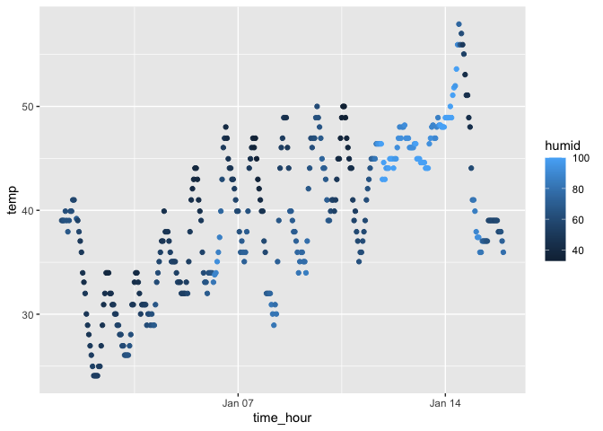

p8105_hw1_th3072
================
Tianyou_He
2023-09-20

``` r
library(moderndive)
library(tidyverse)
```

    ## ── Attaching core tidyverse packages ──────────────────────── tidyverse 2.0.0 ──
    ## ✔ dplyr     1.1.3     ✔ readr     2.1.4
    ## ✔ forcats   1.0.0     ✔ stringr   1.5.0
    ## ✔ ggplot2   3.4.3     ✔ tibble    3.2.1
    ## ✔ lubridate 1.9.2     ✔ tidyr     1.3.0
    ## ✔ purrr     1.0.2     
    ## ── Conflicts ────────────────────────────────────────── tidyverse_conflicts() ──
    ## ✖ dplyr::filter() masks stats::filter()
    ## ✖ dplyr::lag()    masks stats::lag()
    ## ℹ Use the conflicted package (<http://conflicted.r-lib.org/>) to force all conflicts to become errors

``` r
data("early_january_weather")
```

## Problem 1

### Size of the Dataset:

``` r
nrow(early_january_weather)
```

    ## [1] 358

``` r
ncol(early_january_weather)
```

    ## [1] 15

### Mean of temp

``` r
mean(early_january_weather$temp)
```

    ## [1] 39.58212

**Answer**

`1. Variable of Dataset: day, hour, temp, dewp,humid,wind_dir, wind_speed,wind_gust,precip, pressure, visib, time_hour`

`2. The Size of Dataset: row = 358; column = 15`

`3. Mean temperature = 39.58212`

### Scatterplot of time_hour and temp

``` r
ggplot(early_january_weather, aes(x = time_hour, y = temp, color = "humid" )) + geom_point()
```

<!-- -->

``` r
ggsave("Problem_1_scatter.pdf")
```

    ## Saving 7 x 5 in image

`As can be seen from the scatterplot, the temperature tends to increase over time.`

## Problem 2

### Creat a data frame

``` r
random_sample = rnorm(10)

logical_vector <- random_sample > 0

character_vector <- letters[1:10]

factor_vector <- factor(rep(c("red", "green","blue"), times = c(4,2,4)))
```

``` r
df <- data.frame(random_sample, logical_vector, character_vector, factor_vector)
```

### Mean of each vector

``` r
mean(random_sample)
```

    ## [1] 0.4500803

``` r
mean(pull(df,logical_vector))
```

    ## [1] 0.7

``` r
mean(pull(df,character_vector))
```

    ## Warning in mean.default(pull(df, character_vector)): argument is not numeric or
    ## logical: returning NA

    ## [1] NA

``` r
mean(pull(df,factor_vector))
```

    ## Warning in mean.default(pull(df, factor_vector)): argument is not numeric or
    ## logical: returning NA

    ## [1] NA

### Change each vector into numeric

``` r
numeric_logical <- as.numeric(logical_vector)
numeric_character <- as.numeric(character_vector)
```

    ## Warning: NAs introduced by coercion

``` r
numeric_factro <- as.numeric(factor_vector)
```
